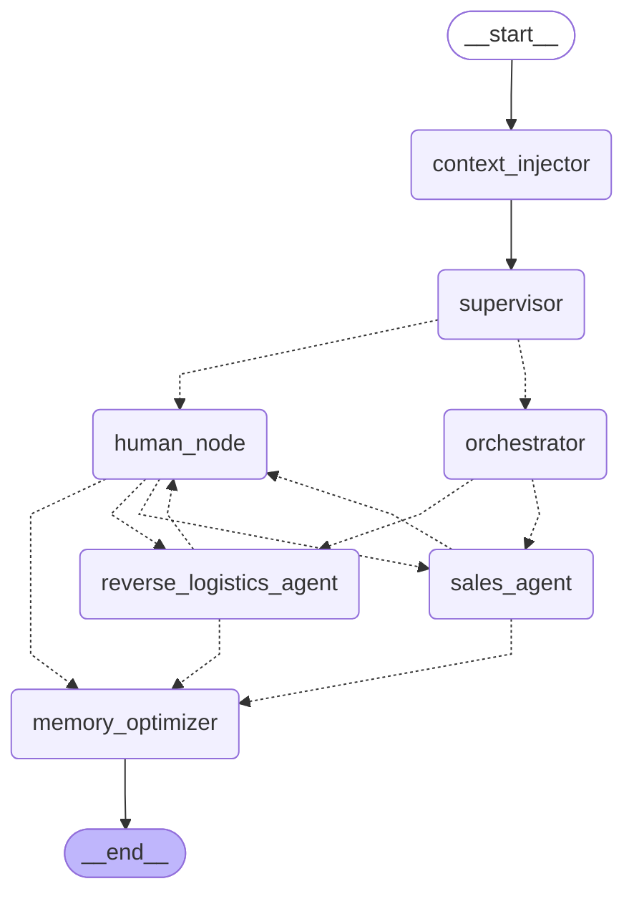

# Sales Agent Graph - LangGraph Architecture

## Nodes Description

| Node | Description |
|------|-------------|
| **context_injector** | Loads user profile and context |
| **supervisor** | Classifies messages (SAFE/UNSAFE) |
| **orchestrator** | Analyzes conversation stage, detects hesitation |
| **sales_agent** | Main sales conversation handler |
| **reverse_logistics_agent** | Handles returns/exchanges |
| **human_node** | Human-in-the-loop intervention |
| **memory_optimizer** | Summarizes long conversations |
